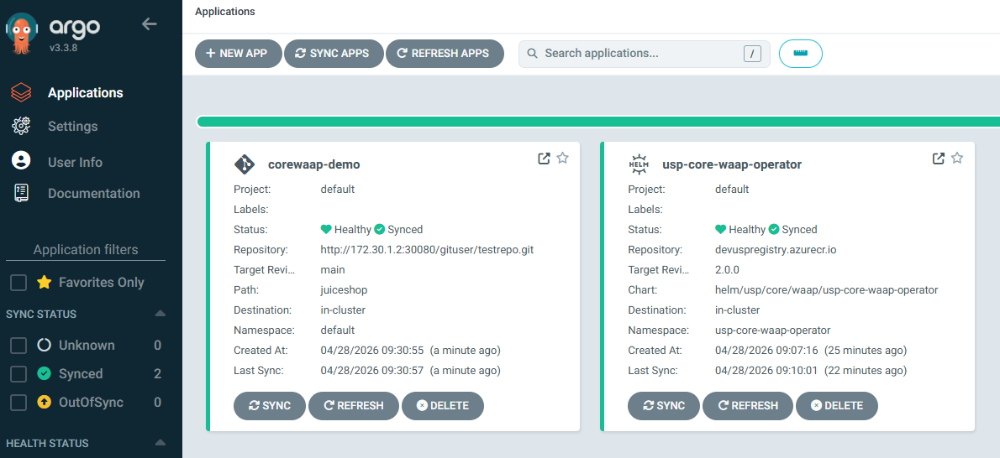

<!--
SPDX-FileCopyrightText: 2026 United Security Providers AG, Switzerland

SPDX-License-Identifier: GPL-3.0-only
-->

&#127919; In this step you will:

* Access Gogs webUI
* Access ArgoCD webUI
* Wait for application deployment to finish

> &#8987; Wait until the console on the right side shows `*** Scenario ready ***` before accessing the backend (otherwise you'll see an `HTTP 502 Bad Gateway` error)!

### Access Gogs webUI

In this scenario the [Gogs](https://gogs.io/) application has been setup and will be used as a local code repository managing the actual applications to be deployed.

Access the application using the following information:

* Link: [Gogs application]({{TRAFFIC_HOST1_30080}}/user/login?redirect_to=)
* Username: `gituser`
* Password: `gitpassword`

### Access ArgoCD webUI

In this scenario the [ArgoCD](https://argo-cd.readthedocs.io/) application has been setup and will be used to deploy and maintain application in a Kubernetes cluster.

Access the application using the following information:

* WebUI: [ArgoCD application]({{TRAFFIC_HOST1_30081}})
* Username: admin
* Get initial Password using command below

> &#10071; Verify that you can login to the [ArgoCD]({{TRAFFIC_HOST1_30081}}) and [Gogs]({{TRAFFIC_HOST1_30080}}) webUI!

```shell
argocd admin initial-password -n argocd
```{{exec}}

<details>
<summary>example command output</summary>

```shell
xxxxxxxxxxxxxxxx

 This password must be only used for first time login. We strongly recommend you update the password using `argocd account update-password`.
```

</details>
<br />

### Wait for application deployment to finish

Having logged into ArgoCD [you should see two applications being deployed]({{TRAFFIC_HOST1_30081}}/applications) initially as shown by the following screenshot:



The applications prepared for you are:

* `corewaap-juiceshop-demo` : an application set of [OWASP Juice Shop](https://owasp.org/www-project-juice-shop/) protected by a USP Core WAAP WAF instance
* `usp-core-waap-operator` : an instance of the USP Core WAAP Operator handling all `CoreWaapService` Kubernetes resources

> &#8987; You may have to wait for the application deployment process to finish (Healthy/Synced)

In the next step we will modify the Core WAAP configuration via the configuration repo / ArgoCD.
